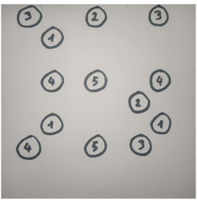

  

# PI_Grid_Recognition

  

## Purpose

  

This service provides grid structure recognition for handwritten and computed Hashiwokakero game grids.

  

  

## Installation

  

### Using docker

The service is ready to be deployed in a docker container:

  

``` ./deploy.sh <root password> ```
  

### With python

You can also run the service with python:

Install dependencies:

``` pip install py-requirements.txt```

Run the service:

``` cd src/ ```

``` python main.py```

## How tu use

### Input
To use this service, you have to POST a jpeg image encoded in base64 (field "photo_b64"), to <ip_adress>:50001/grid.



### Output

The service returns a JSON with the followaing content:

```json

{
	"grid": {
		"dimensions": <int>,
		"circles": [
			{"position": <int>, "img": <base64_string>},
			...
			{"position": <int>, "img": <base64_string>},
		]
	}
}

```
